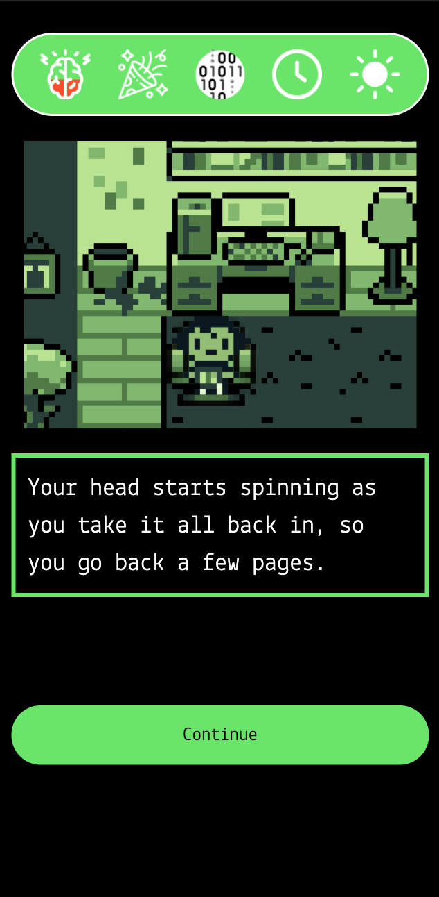
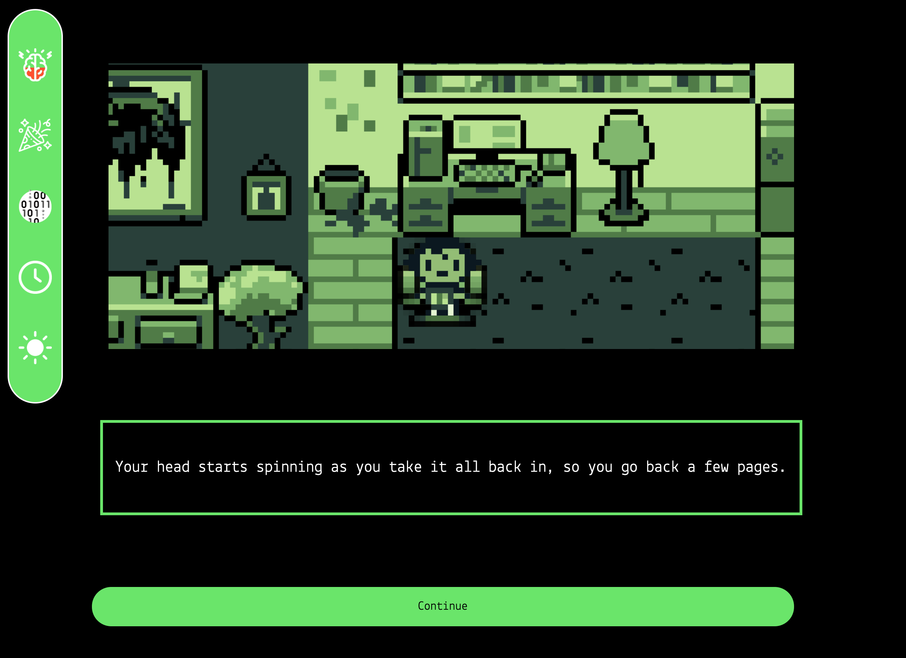
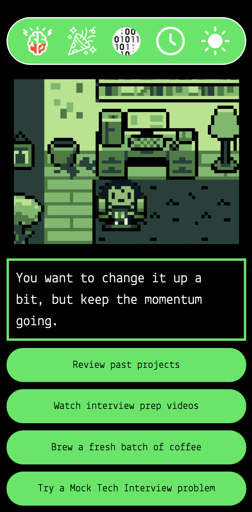
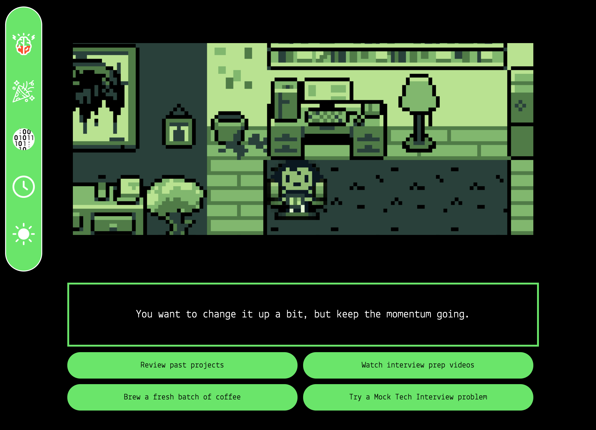

# Ace the Tech Interview!

### Choose your own Adventure game

## Getting Started:

### Click on the link below to play the deployed version:

#### [Ace the Tech Interview Game!](https://ace-the-tech-interview-game.netlify.app/)
### You are a recent boot camp grad and you nailed the first interview! However, you must prep for the technical interview. You have 12 hours to get ready and you have forgotten a few things you have learned in your boot camp. What you choose to do with the next 12 hours will either make or break this technical interview!

### As you play, you must make choices that will either help you maintain sanity as you prepare, or get you closer to descending into programmer madness! Use the time you have left to brush up on powerful design patterns and superstar methods. ~~You can also boost your sanity with one time use objects to keep your wits as you go toe to toe with some of the most grueling coding challenges you have ever faced.~~

## Screenshots:

## Technologies Used:

### Built using JavaScript, HTML, and CSS

## Next Steps:

### - Post MVP:
####    - Additional styling passes
####    - Implement visual feedback when sanity changes, adding or using Sanity Boosters, adding or utilizing Coder Toolbox items, and Time changes
####    - Polish scene art
####    - Implement stat bar tutorial