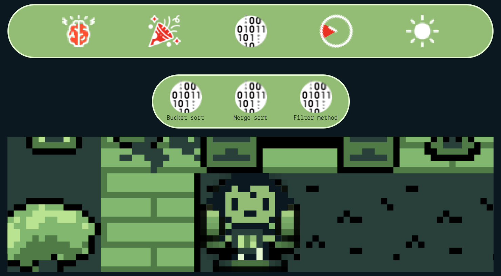
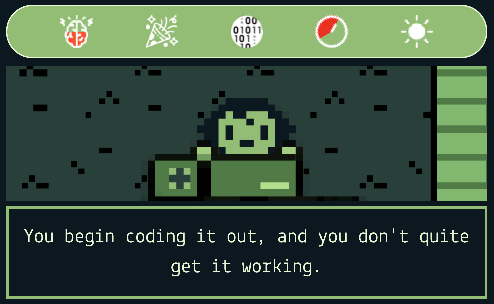

# Ace the Tech Interview!

### Ace the Tech Interview is a choose your own adventure game where you are a recent boot camp grad and you nailed the first interview with a hiring manager. However, you must prep for tomorrow morning's technical interview. You have forgotten a few things you have learned in your boot camp and you have tonight to brush up on your knowledge. What you choose to do with the next 12 hours will either make or break this technical interview!

## Getting Started:

### Click on the link below to play the deployed version:

#### [Ace the Tech Interview Game!](https://ace-the-tech-interview-game.netlify.app/)

## Rules

### As you play, you will be presented with choices that can either help you or hurt you as you study for your technical interview in the morning. Choices can impact your sanity by pushing your mind to its limits, or giving you a much needed break. Watch your sanity meter to determine if it is time to take a break, or crunch some more programming knowledge.

### Along the way you may pick up some items that can boost your sanity that can be used at any time. These sanity boosters may be the only thing that can help you keep your cool during crunch time, so make sure to use them wisely!

### Each time you review programming concepts, a new programming skill will be added to your coding toolbox. This is important because you never know what you will need in order to pass the technical assessment.

### Choices cost you time, so make sure you are focusing on what is really important. Watch the clock as the hours dwindle down to evaluate your decisions. Will you choose to sleep, using valuable hours to regain sanity, or push through the night, taking every minute you can to study up?

## Technologies Used:

* HTML
* CSS
* JavaScript
* Bootstrap
* Animate.css
* Google Fonts

## Wireframe:

## Attributions:

* Icons from [Flaticon](https://www.flaticon.com/): Vectors created by [Smashicons](https://smashicons.com/), [Freepik](https://www.freepik.com/), [dmitri13](https://www.flaticon.com/authors/dmitri13), [Darius Dan](https://www.flaticon.com/authors/darius-dan), and [Good Ware](https://www.flaticon.com/authors/good-ware)
* Sprites by [Pixel Pete](https://petermilko.itch.io/pixel-petes-art-assets)
* Sounds by [Kronbits](https://kronbits.itch.io/freesfx)
* Music by [DOS-88](https://dos88.itch.io/dos-88-music-library)
* Circular progress bar by [Aphinya Dechalert](https://www.dottedsquirrel.com/circular-progress-css/)
## Next Steps:

- [x] Implement stat bar tutorial
- [x] Implement visual feedback when sanity changes, adding or using Sanity Boosters, adding or utilizing Coder Toolbox items, and Time changes
- [x] Polish scene art
- [ ] Transition animation for Sanity Booster and Coder Toolbox submenus
- [ ] Carousel for offscreen items in Sanity Booster and Coder Toolbox submenus
- [ ] Refactor data objects to inherit from .__prototype__ objects
- [ ] Sounds that can be triggered in the middle of scenarios and not just at the start of a new scenario
- [ ] Different music on reaching Endpoint
- [ ] Player stats on reaching Endpoint
- [ ] Additional styling passes